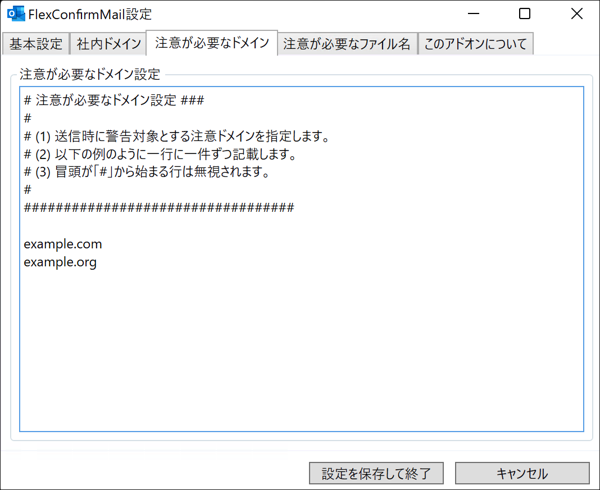
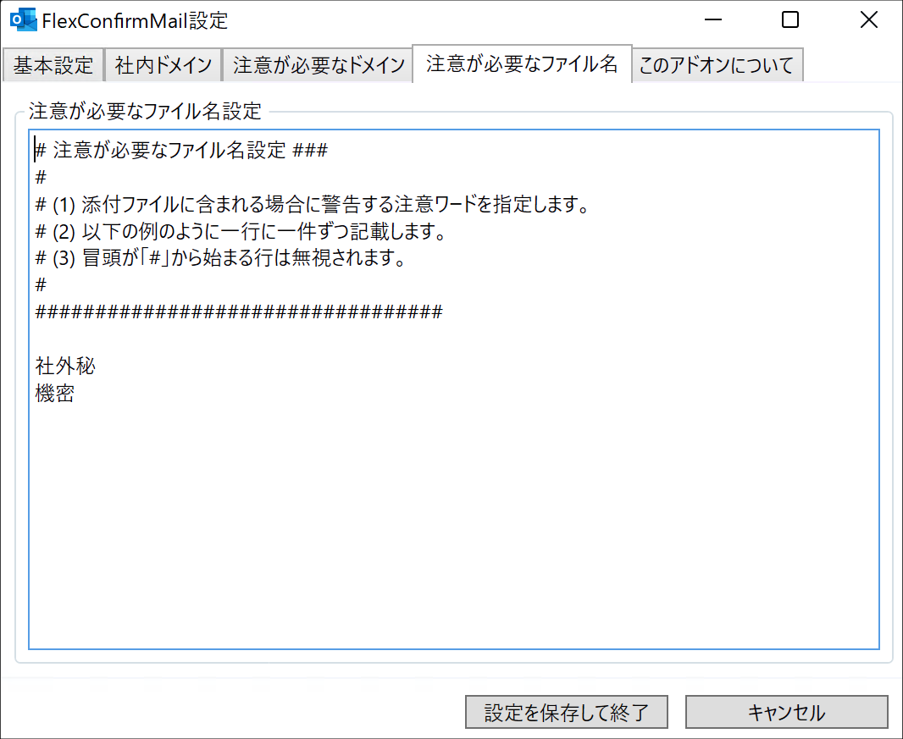
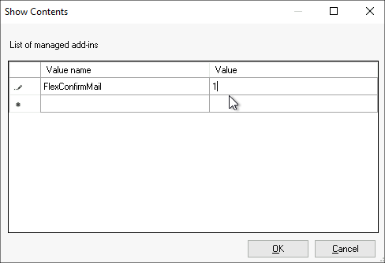

# FlexConfirmMailとは

FlexConfirmMail for Outlook （本文書では FlexConfirmMail と呼びます）とは、
誤送信を防止するためのオープンソースのOutlookアドオンです。
送信時に宛先と添付ファイルをダイアログで確認することで、送信ミスを防ぎます。

 * メールの送信時に、宛先と添付ファイルを確認するダイアログを表示します。
 * チェックリスト形式で確認することで送信ミスを防ぎます。
 * 社内ドメインを登録することで、外部の宛先を区別してチェックできます。

## システム要件

FlexConfirmMailは次のシステムをサポートしています。

 | 項目             | サポートバージョン |
 | ---------------- | ------------------ |
 | システム         | Microsoft Windows 7/8/8.1/10/11 |
 | アプリケーション | Office 2013/2016/2019・Microsoft365デスクトップアプリ |

## ソフトウェアの構成

FlexConfirmMailインストーラには次のファイルが含まれています。

| ファイル                     |  設定内容                           |
| ---------------------------- | ----------------------------------- |
| FlexConfirmMail.dll          | FlexConfirmMail本体                 |
| FlexConfirmMail.dll.manifest | FlexConfirmMailマニフェスト         |
| FlexConfirmMail.vsto         | Outlook向けのアドオン定義           |
| fcm.ico                      | アイコンファイル                    |
| unins000.exe                 | アンインストーラ                    |
| unins000.dat                 | アンインストーラ（データファイル）  |
| Microsoft.Office.Tools.Common.v4.0.Utilities.dll | VSTOアドオンライブラリ |
| Microsoft.Office.Tools.Outlook.v4.0.Utilities.dll | VSTOアドオンライブラリ |

\newpage

# 導入とセットアップ

この章ではFlexConfirmMailのインストール（およびアンインストール）手順を解説します。

## FlexConfirmMailをインストールする

1. FlexConfirmMailSetup.exe を端末に配置します。

2. インストーラを実行し、ウィザードを完遂させます。

   {width=400}

3. メニューバーの「ファイル」からオプションを選択し、有効なアドオンの一覧にFlexConfirmMailが存在していれば成功です。

   {width=400}

## FlexConfirmMailをアンインストールする

 1. スタートメニューから「プログラムの追加と削除」を起動します。

 2. FlexConfirmMailを選択し「アンインストール」を選択します。

\newpage

# FlexConfirmMailの設定

 * FlexConfirmMailの設定はOutlookのリボンのアイコンから変更できます。
 * 設定情報は`%AppData%\FlexConfirmMail`ディレクトリに格納されます。

## 社内ドメインを設定する

 1. Outlookのホームタブから「FlexConfirmMail設定」をクリックします。

 2. 「社内ドメイン」タブをクリックし、ドメインを追記します。

    {width=400}

 3. 「設定を保存して終了」を押下すれば完了です。

## 注意が必要なドメインを設定する

宛先に含まれる場合に、特に注意が必要なドメインの一覧を設定します。

 1. Outlookのホームタブから「FlexConfirmMail設定」をクリックします。

 2. 「注意が必要なドメイン」タブをクリックし、ドメインを追記します。

    {width=400}

 3. 「設定を保存して終了」を押下すれば完了です。

**警告の例**

{width=450}

## 注意が必要なドメインを設定する

注意が必要な添付ファイルのキーワードを設定します。

 1. Outlookのホームタブから「FlexConfirmMail設定」をクリックします。

 2. 「注意が必要なファイル名」タブをクリックします。

    {width=450}

 3. キーワードを追記し、「設定を保存して終了」を押下すれば完了です。

**警告の例**

{width=450}


\newpage

# よくある質問

## インストーラをサイレント実行したい

組織の端末に配布する時などに、FlexConfirmMailをサイレントインストールしたい場合は、
次のように `/SILENT` オプションを利用します。

```
% FlexConfirmMailSetup.exe /SILENT
```

## アドオンが自動的に無効化されるのを防止したい

Office 2013以降にはパフォーマンスを自動的に最適化する機能が組み込まれており、
その一環としてアドオンを自動的に無効化することがあります。

FlexConfirmMailが自動的に無効化されるのを防止するには、グループポリシーで下記の設定を追加ください。

 1. グループポリシーエディタを開き、「ユーザーの構成」を開く。

 2. 「管理用テンプレート > Microsoft Outlook 2016 > その他」を順番に選択する。

 3. 「管理対象アドオンの一覧」の項目をダブルクリックする。

 4. 設定を「有効」にした上で、オプション欄の「表示」ボタンをクリックする。

 5. 値の名前に`FlexConfirmMail`と入力し、値を`1`に設定する。

    {width=300}

 6. 「OK」ボタンを押下して確定する。

アドオンの自動無効化の詳細は、次のMicrosoftの公式ドキュメントを参照ください。

https://docs.microsoft.com/ja-jp/office/vba/outlook/Concepts/Getting-Started/support-for-keeping-add-ins-enabled
