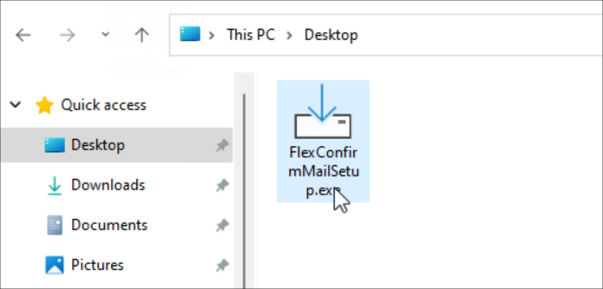
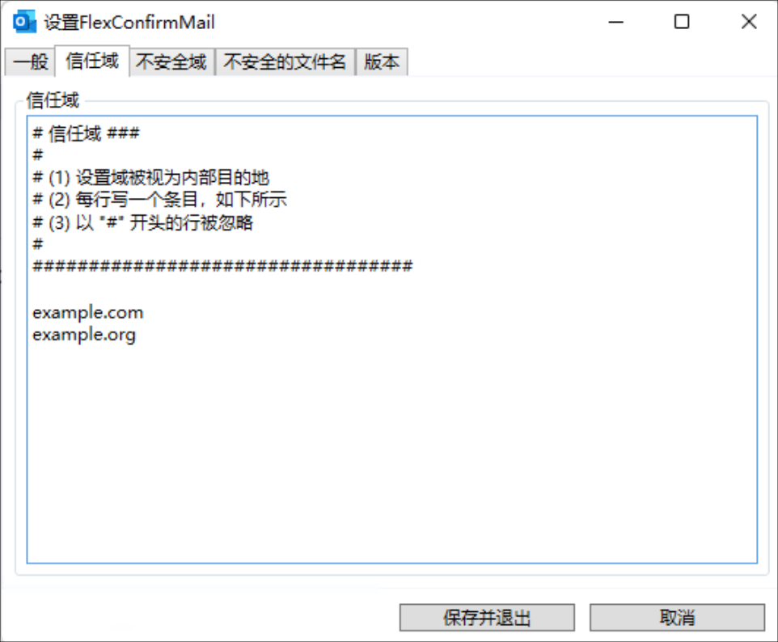
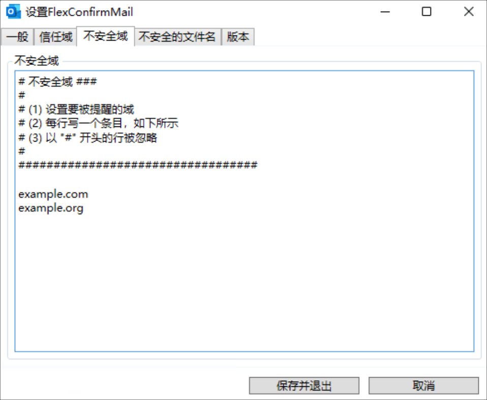
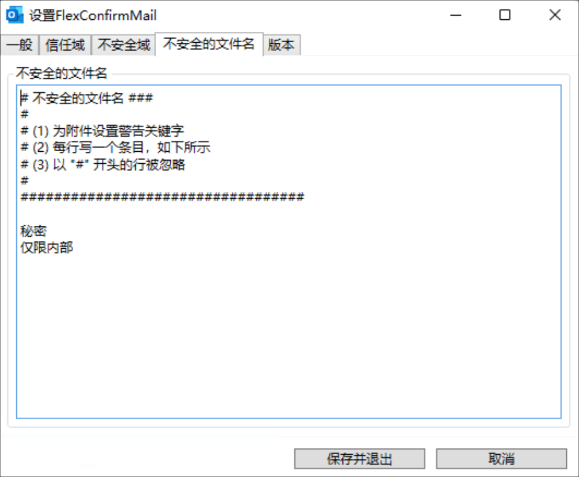

# 关于FlexConfirmMail

FlexConfirmMail for Outlook ("FlexConfirmMail") 是一个帮助消除电子邮件错误的插件。

**功能亮点**

 * 在发送邮件时，显示一个对话框来审查收件人和附件。
 * 提供一个易于遵循的检查表，帮助用户避免常见的错误。
 * 可以通过设置对操作进行调。

## 系统要求

FlexConfirmMail支持以下平台。

 | 项               | 要求               |
 | ---------------- | ------------------ |
 | 作业系统         | Microsoft Windows 7/8/8.1/10/11 |
 | 应用             | Office 2013/2016/2019, Microsoft365 (桌面应用) |

## 文件清单 

FlexConfirmMail由以下文件组成:

| 文件                         | 内容                                |
| ---------------------------- | ----------------------------------- |
| FlexConfirmMail.dll          | FlexConfirmMail                     |
| FlexConfirmMail.dll.manifest | FlexConfirmMail定义文件             |
| FlexConfirmMail.vsto         | Outlook Addin定义文件               |
| fcm.ico                      | 图标文件                            |
| unins000.exe                 | 卸载程序                          |
| unins000.dat                 | 卸载程序                          |
| Microsoft.Office.Tools.Common.v4.0.Utilities.dll | VSTO DLL        |
| Microsoft.Office.Tools.Outlook.v4.0.Utilities.dll | VSTO DLL       |

\newpage

# 安装

本章介绍了如何安装（和卸载）FlexConfirmMail。

## 如何安装FlexConfirmMail

1. 将FlexConfirmMailSetup.exe移至机。

2. 执行安装程序并完成向导。

   {width=400}

3. 选择 "文件>选项"，确认FlexConfirmMail被列为启用的插件。

   {width=400}

## 如何卸载FlexConfirmMail

 1. 在Windows上启动 "添加或删除程序"。

 2. 选择FlexConfirmMail并选择 "卸载"

\newpage

# 设置

 * FlexConfirmMail的设置可以通过对话框进行更改

   {width=400}

 * 设置文件存储在`%AppData%FlexConfirmMail`中。

## 如何设置受信任的域

 1. 点击 "设置FlexConfirmMail"。

 2. 打开 "信任域" 标签并添加域。

    {width=400}

 3. 点击 "保存并退出"。

## 如何设置受不安全的域

 1. 点击 "设置FlexConfirmMail"。

 2. 打开 "不安全域" 标签并添加域。

    {width=400}

 3. 点击 "保存并退出"。

**警告示例**

{width=450}

## 如何设置受不安全的文件名

 1. 点击 "设置FlexConfirmMail"。

 2. 打开 "不安全的文件名" 标签并添加关键词。

    {width=450}

 3. 点击 "保存并退出"。

**警告示例**

{width=450}

\newpage

# 常见问题

## 如何静默安装FlexConfirmMail?

要静默安装FlexConfirmMail（不显示任何对话框），请使用`/SILENT`选项，如下所示

```
% FlexConfirmMailSetup.exe /SILENT
```

## 如何防止FlexConfirmMail被自动禁用

Office 2013或更高版本包含一个优化功能，可自动禁用被检测为缓慢的附加组件。

为了防止FlexConfirmMail被意外地禁用，请设置以下配置。

 1. 打开组策略编辑器, 点击 "用户配置"

 2. 点击 "管理模板 > Microsoft Outlook 2016 > 杂项"

 3. 点击 "托管加载项列表"

 4. 选择 "已启用" 并点击 "显示"

 5. 设置 "FlexConfirmMail" 为 "1"。

    {width=300}

 6. 点击 "确定"

更多细节，请阅读微软的官方文档:

https://docs.microsoft.com/zh-CN/office/vba/outlook/Concepts/Getting-Started/support-for-keeping-add-ins-enabled
